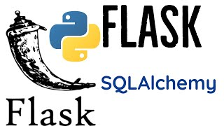

## RestApi Com Flask

# RestApi Com Flask e SQLAlchemy

Esta API pode consultar Pessoas e suas respectivias idades, inserir novas pessoas atribuindo uma nova ID, Consultar e atribuir novas atividades a uma pessoa presente em seu banco de dados.

Esta API tem persistência com o banco de dados, e autenticação com HTTPBasicAuth.

Os arquivos nessessários para utilizar ou testar a API estão presentes no arquivo requirements.txt